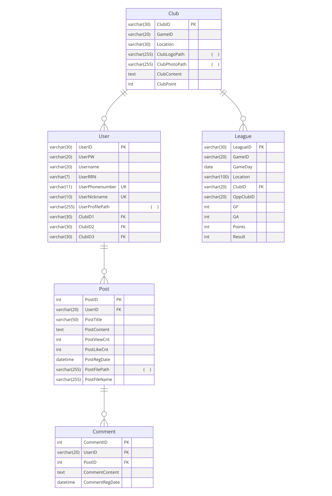

# SPONOVA(스포노바)

### 서비스 소개

> Sports와 Innovation의 합성어로, 스포츠의 새로운 지평을 열고자 하는 스포츠 네트워크입니다. 뉴스포츠 종목들을 소개하고, 클럽 커뮤니티와 리그 시스템을 통해 기존의 스포츠 팬들과 새로운 스포츠에 관심 있는 이들 모두에게 독특하고 즐거운 경험을 제공합니다. 전통적인 스포츠 경계를 넘어서 새로운 형태의 스포츠인 뉴스포츠를 통해 세대를 아우르는 건강하고 활동적인 커뮤니티를 만들어가는 것을 목표로 합니다.

 

## 개발 환경

#### 프레임워크

#### 데이터베이스

#### API

#### 협업

<!--
  
  
  
  
  
  
  
   -->

 

## 팀원소개

<table>
  <tbody>
    <tr>
      <td align="center"><a href="https://github.com/ghlim00"> <b>임가현</b></a> </td>
      <td align="center"><a href="https://github.com/FickleBoBo"> <b>육민우</b></a> </td>
    </tr>
  </tbody>
</table>

 

## ERD

## 주요기능

- 회원관리

  - 회원 가입

    - 아이디, 비밀번호, 이름, 닉네임, 주민등록번호, 전화번호 입력
    - 아이디, 닉네임, 전화번호 입력 시 중복 여부 확인
    - 가입 완료 시 로그인 페이지로 이동

  - 로그인

    - 아이디, 비밀번호 입력
    - 로그인 완료 시 로그인 성공 모달 출력

  - 로그아웃
    - 로그아웃 시 메인 페이지로 이동

- 게임 소개 페이지

  - 뉴스포츠 소개 및 개별 종목 소개 카드
    - 카드 내 버튼을 통한 상세 설명 페이지 바로가기 기능
  - 종목 상세 페이지
    - 상세 설명과 경기 영상 바로가기

- 게시판 서비스

  - 게시글

    - 게시글 목록(제목, 작성자, 작성일, 조회수, 댓글 수)를 페이지네이션을 이용하여 출력
    - 게시글 조회
      - 누구나 게시글 조회 가능(비회원 포함)
    - 게시글 작성
      - 로그인 한 사람만 글 작성 가능
    - 게시글 삭제
      - 해당 게시글 작성자만 삭제 가능
    - 게시글 수정
      - 해당 게시글 작성자만 글 수정 가능(제목, 내용)

  - 댓글

    - 로그인 한 사람만 댓글 작성 가능
    - 댓글 삭제는 댓글 작성자만 가능

  - 검색

    - 제목(일부 키워드 포함) 검색 기능

  - 정렬
    - 작성일
      - 최신순, 오래된 순으로 게시글 정렬 가능
    - 조회수
      - 조회수가 높은 순 또는 낮은 순으로 게시글 정렬 가능

- 클럽 관리

  - 카드 형식으로 모든 클럽 조회 가능
  - 카드 내 버튼 클릭 시 클럽 소개 모달 출력
  - 검색을 통한 종목별 클럽 조회 가능

- 리그 관리

  - 리그 순위 조회

    - 종목별 리그 순위 조회 기능
      - 순위, 클럽명, 승점 출력
      - 1/2/3위는 메달 뱃지 부여

  - 오늘의 경기
    - 대결 클럽과 장소를 출력
      - 장소 클릭 시 지도 모달을 통한 경기 장소 확인 기능
