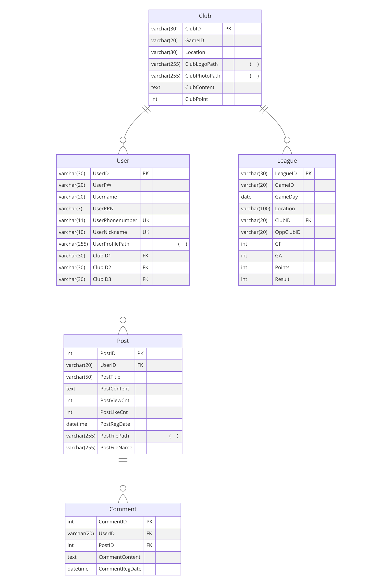

## 1. Login 기능
- Login 페이지로 이동해서 Login 처리

## 2. 네비게이션 바
- Home
  - 그냥 홈으로 보내주는 기능
- Intro
  - 웹사이트에 대한 다양한 소개 페이지(ex 비전, 조직도, 오시는 길)
- Game
  - 각각의 뉴스포츠 종목에 대해서 설명해주는 페이지
  - 중복 라우터 + 라우터링크 바인딩으로 하위 페이지로 이동
- League
  - 웹 사이트 주최 대회에 대한 현황 및 통계를 제공하는 기능
  - 지난 대회, 현재 진행 중인 대회, 앞으로 진행할 대회 3가지
  - 지난 대회는 DB에 데이터 넣어놓은거 처리만 해서 통계로 보여줌
  - 현재 진행 중인 대회도 마찬가지고 좀 더 이쁘게 랭킹 보여줌
  - 앞으로 진행할 대회는 신청 기능
- Club
  - 각각의 동호회에 대해서 카드 형식으로 띄워주고 클릭을 통해 가입 신청 정도 보내는 기능
- Community
  - 일단 게시판 기능 만들어서 구현 (댓글 O)
  - 친선 경기 매칭 기능 
  
## 3. 마이페이지
- 개인 정보 + 가입한 클럽 정보 + 리그 참여 통계 제공
- 본인이 작성한 게시글 조회

## 4. 기타
- 뉴스포츠 라는 느낌과 어울리게 페이지를 동적으로 꾸미고 싶음(ex 2028 LA) https://la28.org/

## ERD 
